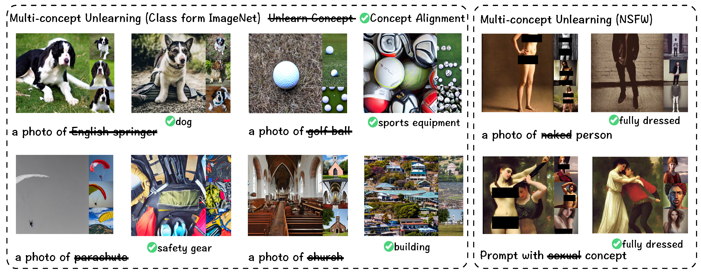

# Sculpting Memory: Multi-Concept Forgetting in Diffusion Models via Dynamic Mask and Concept-Aware Optimization
Sample code used for ICCV 2025 paper:
[Sculpting Memory: Multi-Concept Forgetting in Diffusion Models via Dynamic Mask and Concept-Aware Optimization](https://arxiv.org/abs/2504.09039)
## Introduction
We propose a novel framework combining Dynamic Mask and Concept-Aware Loss to address multi-concept forgetting in diffusion models. Our approach overcomes key limitations of existing methods, such as instability in iterative forgetting, poor post-unlearning generation, and degradation of model performance for unrelated concepts.



## Experiment Result
 Quantitative results for unlearning 10 target classes on the Imagenette dataset.
 
 Results of NudeNet detection on the I2P dataset. “(F)” denotes female, and “(M)” denotes male.
 

## Setup (reference from [FMN](https://github.com/SHI-Labs/Forget-Me-Not))

```
conda create -n Sculp_Mem python=3.8
conda activate Sculp_Mem

pip install torch==1.13.1+cu116 torchvision==0.14.1+cu116 torchaudio==0.13.1 --extra-index-url https://download.pytorch.org/whl/cu116

pip install -r requirements.txt
```

## Dataset Preparation
To prepare the dataset, we need to generate images for both the unlearning class and its corresponding superclass. Running `preprocess.py` will generate these images (100 images per class) in the folder `multi_class_data_100_sd`.

## Training
We have prepared a sample script in `run.sh`, with specific parameter settings in the `multi_configs` folder.
We will use `multi_dst_train.py` for our experiments. The key arguments and their usage are listed below.  
For `multi_dst_train.py`:  
- `--data_path` This argument specifies the path to your dataset. Default setting is:`./multi_class_data_100_sd`
- `--batch_size` This argument specifies the batch size for training.
- `--image_size` This argument specifies the size of the images used for training.
- `--update_mask` This argument determines whether to update the mask during training.
- `--device` This argument specifies the device to use for training.
- `--method` This argument specifies the training method to use.
- `--unlearn_class` This argument specifies the number of class to unlearn.
- `--num_epochs` This argument specifies the number of epochs for each class unlearning.
- `--warmup_steps` This argument specifies the number of warmup steps.
- `--mask_update_interval` This argument specifies the interval for updating the mask.
- `--scale` This argument specifies the scale factor for align loss in training.
- `--scale_kd` This argument specifies the scale factor for kd loss in training.
- `--save_path` This argument specifies the path to save the trained model.
- `--mixed_precision` This argument specifies whether to use mixed precision training.
- `--log_file` This argument specifies the file to log training information.
- `--img_save_path` This argument specifies the path to save generated images.

## Evaluate

For our evaluation, we first generate a set of images and then report the unlearning accuracy (or, alternatively, the nudity‐detection results), as well as the CLIP score and the Fréchet Inception Distance (FID). We have a sample log in `multi_class_logs/logs_example.log`

## TODO:
We will upload the model checkpoints in huggingface later.

